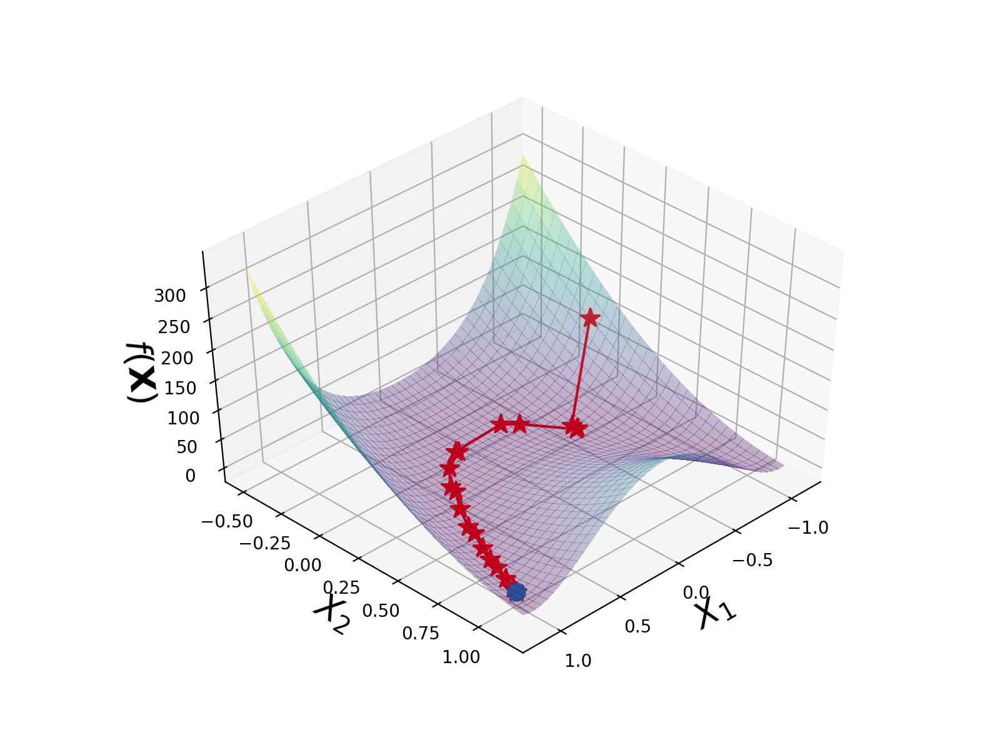

# Minimize [](https://www.python.org/downloads/release/python-360/)

This repository is a Python implementation of C.E. Rasmussen's [minimize](http://learning.eng.cam.ac.uk/carl/code/minimize/) function which finds a (local) minimum of a (nonlinear) multivariate function. The function uses conjugate gradients and approximate linesearches based on polynomial interpolation with Wolfe-Powel conditions. The user supplies a function which returns the function value as well as the partial derivatives with respect to the variables to be minimized.

Notes:
- Tested for python >= 3.6

## minimize Usage

Here the two-dimensional [rosenbrock](https://en.wikipedia.org/wiki/Rosenbrock_function) function is used to show how minimize works. The function returns the function value and the partial derivatives with respect to the variables to be minimized.

Starting from initial conditions X0 = np.array([[-1],[0]]) and length = 100 "linesearches":

>>> X, convergence, i = minimize(rosenbrock, X0, length=100)

>>> X  = array([[1.],[1.]])

>>> i = 33

The minimum of the function occurs at X = [1., 1.] with a function value of 0 and is determined after 33 iterations. The convergence returned by minimize has the function evaluations in the first column, and the parameters being minimised in the following D columns. The figure below shows the convergence values plotted over the rosenbrock function. If the length parameter is set to a negative value then the algorithm is limited by function evaluations rather than linesearches. 


## check_grad usage

The check_grad function can be used to check that the function values and partial derivatives are consistent. The check_grad function compares the values of the partial derivatives returned by the function with a finite difference approximation. check_grad prints a comparison of the partial derivatives and the finite difference approximation and returns the norm of the difference divided by the norm of the sum of the partial derivatives and finite differences. 

```
d = check_grad(f, X, e, args=())

Parameters
----------
f : function to minimize. The function must return the value
	of the function (float) and a numpy array of partial
	derivatives of shape (D,) with respect to X, where D is
	the dimensionality of the function.

X : numpy array - Shape : (D, 1)
	argument for function f that the partial derivatives
	relate to.

e : float
	size of the perturbation used for the finite differences.

args : tuple
	Tuple of parameters to be passed to the function f.

Return
------
d : the norm of the difference divided by the norm of
	the sum.
```

It is used as follows:

```
>>> np.random.seed(0)

>>> X = np.random.normal(0, 1, size=(3,1))

>>> d = check_grad(rosenbrock, X, 1e-5)

>>> Gradients vs finite difference:
>>> 1914.97696491 1914.97696499
>>> -674.57380768 -674.57380767
>>> 163.72243854  163.72243854

>>> print("d : ", d)

>>> d :  1.9199773511233608e-11
```